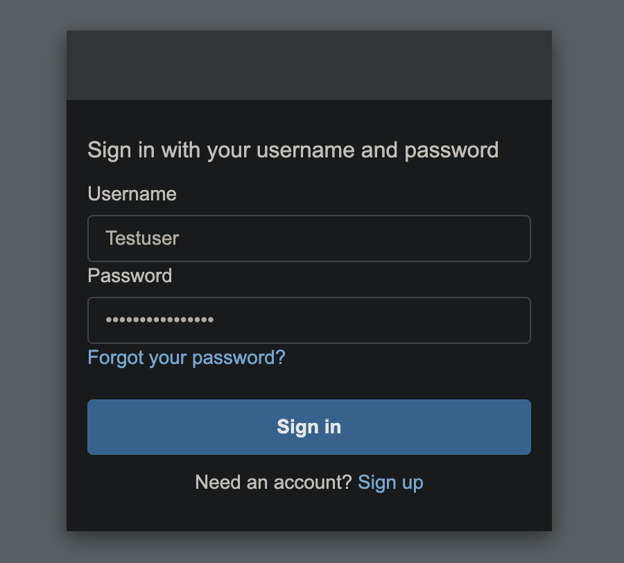
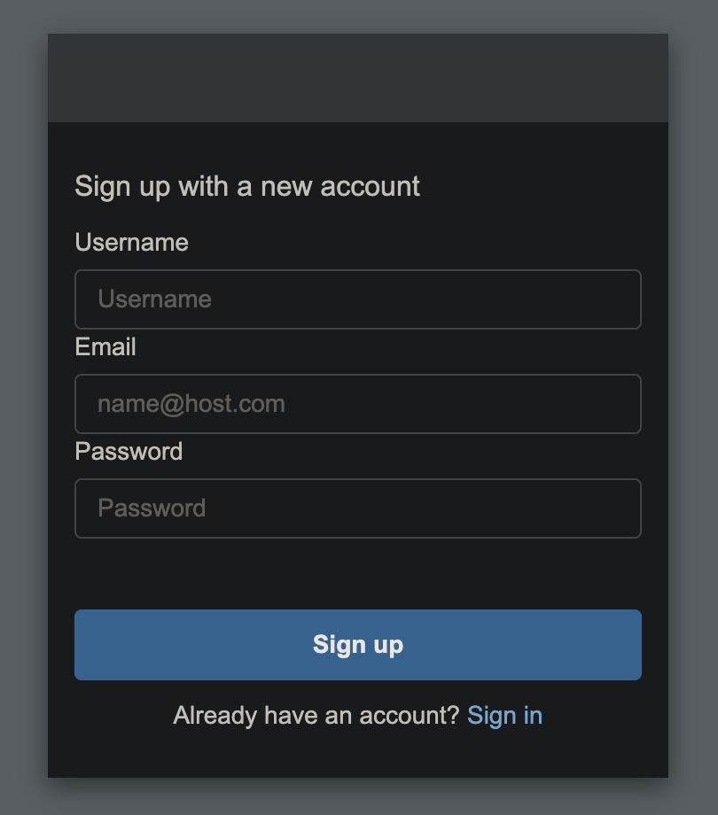
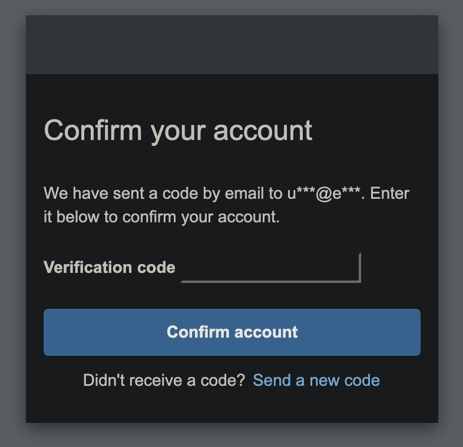
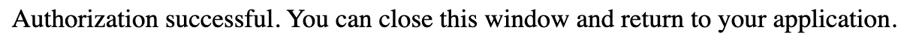
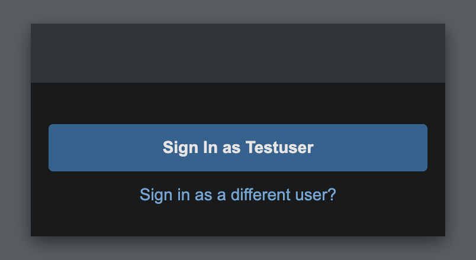

# AWS Severless RESTful API with OIDC & OAuth2.0
## Overview
This project contains Python scripts to automate the creation, management, and deletion of AWS infrastructure using AWS services like Cognito, API Gateway, Lambda, and IAM. It provides functionalities to set up a complete serverless application with user authentication, a RESTful API, Lambda function, and OAuth2.0 scope authorizer.

## Purpose
The project serves an educational purpose. On the one hand, it strives to provide you a serverless environment (with minimal costs) to explore the important authentication and authorization concepts OIDC and OAuth2.0. On the other hand, it teaches the required steps to create a secure serverless API in AWS. It creates (and also deletes) all AWS resources, performing all required API calls without hiding anything from the user. This project can be considered Infrastructure as Code. Compared to other tools like Terraform, AWS SAM (Serveless Application Model), and AWS CloudFormation, this project does not come with complex state management, rollback, wait and update functionalities. Instead it strives to make the necessary steps to create the infrastructure as clearly as possible.

## Features
- Create AWS Cognito User Pool, App Client, and Resource Server
- Showcases how a terminal application can authenticate and authorize a user for API calls (inspired by Azure's `az login` command) 
- Create and manage AWS HTTP API Gateway with Lambda integration
- Assign necessary IAM roles and permissions
- Generate OAuth2 access tokens for testing
- Clean up and delete all created resources


## AWS Infrastructure Automation Scripts

This repository contains scripts to automate the creation and deletion of AWS infrastructure resources using Python and Boto3. The main scripts included are:

- `create.py`: Automates the creation of AWS resources. Stores the created resource ids in a `state.json` file for later deletion.
- `tokens.py`: Generates access tokens for a test user created in `create.py` and performs authorized requests against the API Gateway.
- `delete.py`: Deletes the resources created by `create.py` using the `state.json` file.


## Requirements
- Linux or Mac (Windows user need to create their own .env file and python environment)
- Python 3.7+
- AWS CLI configured with necessary permissions
- Environment variables for PASSWORD and DOMAIN_PREFIX

## Setup

1. **Clone the repository:**

    ```bash
    git clone https://github.com/LeonardSchuler/aws-secure-serverless-api.git
    cd aws-secure-serverless-api
    ```

### Automatic Setup

2. **Use the `Makefile` to set up everything automatically:**
    ```bash
    make
    ```
### Manual Setup
Follow this setup if you want to understand what the Makefile does or if you want to do everything yourself.

2. **Create and activate a virtual environment:**

    ```bash
    python3 -m venv .venv
    source .venv/bin/activate
    ```

3. **Install the required packages:**

    ```bash
    pip install -r requirements.txt
    ```

4. **Set up environment variables:**

    Create a `.env` file in the root directory of the project with the following content:

    ```bash
    export AWS_DEFAULT_REGION=your-region
    export AWS_PROFILE=your-aws-profile
    export PASSWORD=your-password
    export DOMAIN_PREFIX=your-domain-prefix
    ```


## Usage

### Creating Resources
To create the necessary AWS resources
you can either use make:
```bash
make api  
```
or start the `create.py` script yourself using:
```bash
source .venv/bin/activate
python create.py
```
A sample output could be:
```
User Pool created with ID: 'us-east-1_abcdef'
User pool signup/signin page created at: 'https://domainprefix.auth.us-east-1.amazoncognito.com'
Resource Server created with ID: 'HelloAPI'
Terminal app Client created with client id: '1234fgc1abcdefghijklm1234a'
User 'Testuser' created with email 'testuser@example.com' in User Pool 'us-east-1_abcdef'.
API Gateway 'HelloAPI' HTTP API created with ID: 'aoe1ba4ed6'
Authorizer created with ID: '1abc01'
Lambda execution role created with ARN: 'arn:aws:iam::123456789876:role/APIGatewayLambdaRole'
Creating lambda with role 'arn:aws:iam::123456789876:role/APIGatewayLambdaRole'
Lambda function created with name: 'EchoFunction'
Permission added to Lambda function for API Gateway to invoke it.
Integration created with ID: 'qacdef1'
Route 'GET /hello' created with ID: '2ab2cd2'
(Auto deploy) stage created with name: 'dev'
API available at: 'https://someid.execute-api.us-east-1.amazonaws.com/dev/hello'
State saved in 'state.json'
```
Take a look at the created `state.json` file.

### Accessing the API
Given the previously created API you can attempt an unauthorized request using:
```bash
curl -v https://someid.execute-api.us-east-1.amazonaws.com/dev/hello
```
with the following output:
```bash
# Request
GET /dev/hello HTTP/2
Host: someid.execute-api.us-east-1.amazonaws.com
User-Agent: curl/8.6.0
Accept: */*

# Response
HTTP/2 401 
date: Sun, 16 Jun 2024 21:00:16 GMT
content-type: application/json
content-length: 26
www-authenticate: Bearer
apigw-requestid: Aab-Bcd-Cdefg-h=

{"message":"Unauthorized"}
```

To perform an authorized API request, you can either use make:
```bash
make request
```
or start the `tokens.py` script yourself using:
```bash
source .venv/bin/activate
python tokens.py
```

This will open a browser login window that looks like this:

You need to provide Testuser as the Username.
The password can be found in your `.env` file. If you used make the password is also displayed in your terminal.
If you want to create a new user, change the '/login' to '/signup' in your address bar, leaving everything else the same.
You will see this window

Signing up with a valid email address will result in this confirmation page:

If you provided a valid email address you will receive an email with a verification code from AWS (no-reply@verificationemail.com).

After clicking the 'Sign in' (or 'Confirm account') button your browser will redirect you to http://localhost:8083/callback with an authorization code query parameter.
If everything was successful your browser will display:



Return to your terminal application. The terminal app will exchange the authorization code for an (optional) id token (only present if you provide the openid scope), an access token, and a refresh token. It will print your id, access, and refresh token raw as base64 jwt token but also decoded for you to analyze.
```bash
# Decoded id token
{
    'at_hash': '',
    'sub': '',
    'email_verified': True,
    'iss': 'https://cognito-idp.us-east-1.amazonaws.com/us-east-1_abcdefghi',
    'cognito:username': 'Testuser',
    'origin_jti': '',
    'aud': 'client-id-of-the-terminal-application',
    'token_use': 'id',
    'auth_time': 1234567899,
    'exp': 1234570000,
    'iat': 1234567899,
    'jti': '',
    'email': 'testuser@example.com'
}
# Decoded access token
{
    'sub': '',
    'iss': 'https://cognito-idp.us-east-1.amazonaws.com/us-east-1_abcdefghi',
    'version': 2,
    'client_id': 'client-id-of-the-terminal-application', # most other token issuer would use 'aud' instead of 'client_id'
    'origin_jti': '',
    'token_use': 'access',
    'scope': 'openid profile HelloAPI/hello.read email',
    'auth_time': 1234567899,
    'exp': 1234570000,
    'iat': 1234567899,
    'jti': '',
    'username': 'Testuser'
}
```

The `tokens.py` script validates the id and access tokens and then performs a GET request against the API using the access token. This request should succeed and return a "hello world" message:
```bash
# Request
GET /dev/hello HTTP/2
Host: bde0yk8fd5.execute-api.us-east-1.amazonaws.com
User-Agent: curl/8.6.0
Accept: */*
Authorization: Bearer ey...

# Response
HTTP/2 200 
date: Sun, 16 Jun 2024 21:02:00 GMT
content-type: application/json
content-length: 11
apigw-requestid: abcdefghijklmno=

hello world
```

At the top of the `tokens.py` file change the SCOPES variable to one of the other commented scopes. For example:

```python
SCOPES = ["openid"]
```
and repeat the command:
```bash
make request
# alternatively
python tokens.py
```

On your second try your browser will remember your previous login:



Logging in again and returning to the terminal application the following requests were made for you:

```bash
# Request
GET /dev/hello HTTP/2
Host: bde0yk8fd5.execute-api.us-east-1.amazonaws.com
User-Agent: curl/8.6.0
Accept: */*
Authorization: Bearer ey...

# Response
HTTP/2 403 
date: Sun, 16 Jun 2024 21:06:02 GMT
content-type: application/json
content-length: 23
www-authenticate: Bearer scope="HelloAPI/hello.read HelloAPI/hello.write" error="insufficient_scope" error_description="expected scopes: [HelloAPI/hello.read HelloAPI/hello.write]"
apigw-requestid: babcdefghikjlmn=

{"message":"Forbidden"}
```

Observe that the access token only contained the scope 'openid' in the output. AWS Api Gateway also tells you which scopes it is expecting, namely either 'HelloAPI/hello.read' or 'HelloAPI/hello.write'. Note that either one of those scopes allows access to the API.


### Deleting Resources
To delete the AWS resources you can either use make:
```bash
make delete
```
or start the `delete.py` script yourself using:
```bash
source .venv/bin/activate
python delete.py
```

### (Optional) Clean up
The following resets the repository to its original state, deleting caches, requirements.txt, python's virtual environment, and state.json file.
```bash
make clean
```